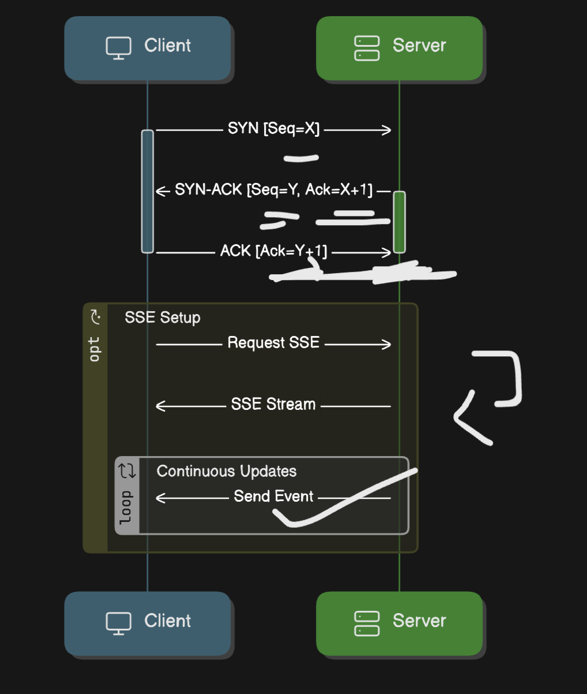

# Server-Sent Events (SSE)

Server-Sent Events (SSE) is a web technology that enables servers to push data
to web clients in real-time over a single HTTP connection. This document covers
everything you need to know about SSE, from its basics to implementation and use
cases.

## What are Server-Sent Events?

SSE is a standard that allows a web server to send events to a client's web
browser. It's a one-way communication channel where the server can push data to
the client without the client requesting it.

## How SSE Works

1. The client establishes a connection to the server using a standard HTTP
   request.
2. The server keeps this connection open and sends data to the client when new
   information is available.
3. The client receives these updates in real-time without having to poll the
   server.

## Key Features of SSE

- **Unidirectional**: Data flows from server to client only.
- **Simple Protocol**: Uses standard HTTP for communication.
- **Automatic Reconnection**: Browsers automatically attempt to reconnect if the
  connection is lost.
- **Event IDs**: Allows for message ordering and resuming from where the
  connection was lost.
- **Event Types**: Supports custom event types for categorizing different kinds
  of updates.

## SSE vs WebSockets

While both technologies enable real-time communication, SSE is simpler and more
lightweight than WebSockets:

- SSE is unidirectional; WebSockets are bidirectional.
- SSE uses standard HTTP; WebSockets use a custom protocol.
- SSE has better native browser support and is easier to implement.

## How it works

The TCP 3-way handshake with Sequence Numbers works like this:

SYN (Synchronize)

- The client sends a packet with a SYN flag to the server to initiate a
  connection.
- It includes a random Sequence Number (Seq = X) to start tracking data in
  order.

SYN-ACK (Synchronize-Acknowledgment)

- The server responds with its own SYN and acknowledges the client’s sequence by
  setting Ack = X+1.
- The server also sends its own Sequence Number (Seq = Y).

ACK (Acknowledgment)

- The client acknowledges the server’s sequence by sending Ack = Y+1.
- At this point, the connection is established, and data transfer can start.

Once the TCP connection is established, SSE can operate over HTTP by sending a
continuous stream of data. The TCP layer’s reliability guarantees that each SSE
message reaches the client, allowing it to process real-time updates
consistently without polling.

SSE allows a server to push updates directly to a client over a single,
persistent connection. It’s like the server saying, ‘Hey, I’ll let you know as
soon as there’s something new’—instead of the client constantly checking in,

With SSE, we make just _one_ request, and the server keeps the connection open,
pushing data to the client as soon as it's available—so updates are almost
instant.

SSE is ideal for applications needing real-time updates, like stock tickers,
news feeds, or notifications. You get a steady stream of data without the
overhead of constant reconnecting.

Plus, SSE uses HTTP, making it easy to implement. For efficient, low-latency
updates, _Server-Sent Events_ is the way to go!
